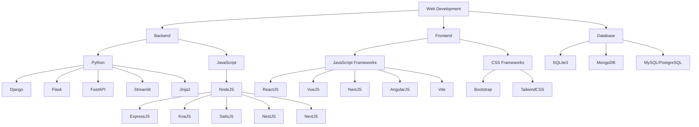
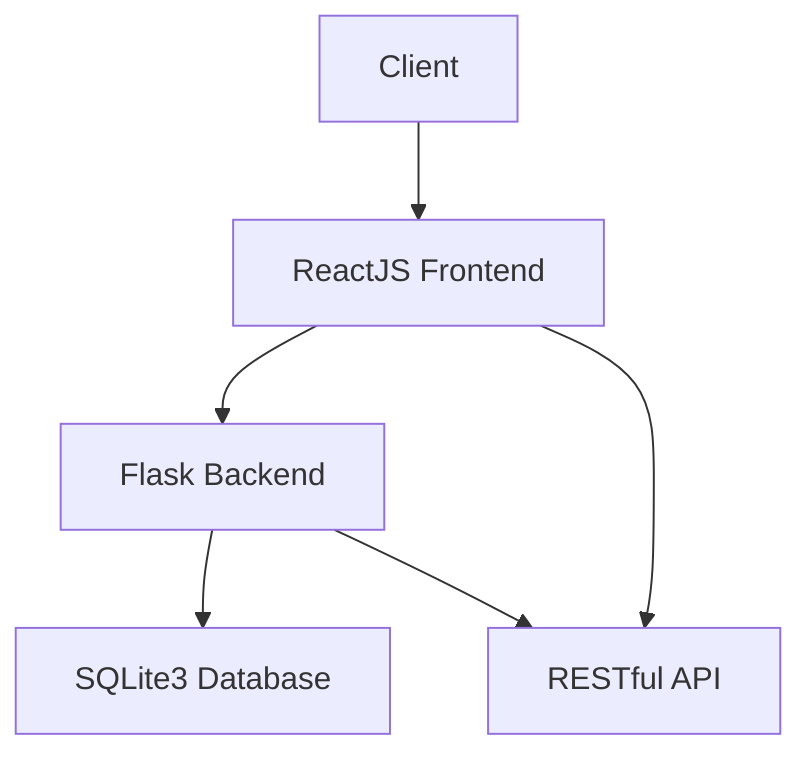

#### **Title**: Introduction to Web Development
#### **Description**: Overview of modern web development technologies, frameworks, and tools.

---

# Introduction to Web Development

This README provides an overview of modern web development technologies, frameworks, and tools. It covers backend and frontend options, databases, extra tools, and documentation requirements. Mermaid charts are used to visualize relationships and tech stacks.

---

## Table of Contents
- [Introduction to Web Development](#introduction-to-web-development)
	- [Table of Contents](#table-of-contents)
	- [Backend Technologies](#backend-technologies)
		- [Python](#python)
		- [JavaScript (Node.js)](#javascript-nodejs)
	- [Frontend Technologies](#frontend-technologies)
		- [JavaScript Frameworks](#javascript-frameworks)
		- [CSS Frameworks](#css-frameworks)
	- [Databases](#databases)
	- [Extra Tools](#extra-tools)
	- [Documentation](#documentation)
	- [Tech Stacks](#tech-stacks)
	- [Mermaid Diagrams](#mermaid-diagrams)
		- [Tech Stack Relationships](#tech-stack-relationships)
		- [Sample Tech Stack: ReactJS + Flask + SQLite3](#sample-tech-stack-reactjs--flask--sqlite3)
	- [Getting Started](#getting-started)

---

## Backend Technologies

### Python
Python offers a variety of frameworks for web development, each with unique strengths:

1. **Django**
   - Heavyweight framework with built-in features (ORM, admin panel, etc.).
   - Template-based rendering.
2. **Flask**
   - Lightweight and flexible microframework.
3. **FastAPI**
   - Modern, fast, and designed for server-side APIs with async support.
4. **Streamlit**
   - Primarily for quickly building web UIs, often for data-driven apps.
- **Jinja2**
   - Templating engine to add conditionality to static HTML, commonly used with Flask and Django.

*Note:* These can serve as the backend for your application.

### JavaScript (Node.js)
Node.js enables server-side JavaScript development with the following frameworks:

1. **ExpressJS**
   - Lightweight and minimalistic, widely used.
2. **KoaJS**
   - Lightweight, modern alternative to ExpressJS with async/await support.
3. **SailsJS**
   - Heavyweight MVC framework, similar to Django.
4. **NestJS**
   - Modern framework for building scalable server-side applications with TypeScript support.
5. **NextJS**
   - Primarily for server-side rendering (SSR) and static site generation (SSG).

*Note:* These can serve as the backend or hybrid frontend/backend (e.g., NextJS).

---

## Frontend Technologies

### JavaScript Frameworks
Frontend development heavily relies on JavaScript frameworks for dynamic UIs:

1. **ReactJS**
   - Component-based, ideal for beautiful UIs with libraries like:
     - ChadCN
     - Ant Design
     - ChakraUI
     - MUI (Material-UI)
2. **VueJS**
   - Similar to ReactJS, lightweight and progressive.
3. **NextJS**
   - Extends React with SSR and SSG capabilities.
4. **AngularJS**
   - Heavyweight framework with a steep learning curve but robust features.
- **Vite**
   - Modern build tool, replacing Create React App (CRA) for faster development.

### CSS Frameworks
Styling solutions to accelerate frontend development:

1. **Bootstrap**
   - Classic, widely-used CSS framework with prebuilt components.
2. **TailwindCSS**
   - Utility-first CSS framework for rapid, custom designs.
- *For React:* Prefer UI component libraries (e.g., MUI, ChakraUI) over raw CSS frameworks.

*Note:* These frameworks enhance the frontend experience.

---

## Databases
Choose a database based on your application's needs:

1. **SQLite3**
   - Simplest and easiest for small-scale apps or prototyping.
2. **MongoDB**
   - NoSQL database for flexible, document-based data.
3. **MySQL / PostgreSQL**
   - Relational databases for structured data with strong consistency.

---

## Extra Tools
Enhance your development workflow with these tools:

1. **RESTful API**
   - Standard for designing networked APIs.
2. **Markdown**
   - Lightweight markup language for documentation (like this README).
3. **Mermaid**
   - JavaScript-based diagramming tool for charts and flowcharts (see below).

---

## Documentation
Essential documentation files for any project:

1. **README.md**
   - Project overview and setup instructions (this file).
2. **TODO.md**
   - List of tasks and pending features.
3. **ARCHITECTURE.md**
   - High-level system design and architecture details.
4. **ROADMAP.md**
   - Project timeline and future plans.

---

## Tech Stacks
Sample tech stacks combining the above technologies:

1. **ReactJS + Flask + SQLite3**
   - Frontend: ReactJS for dynamic UI.
   - Backend: Flask for lightweight API.
   - Database: SQLite3 for simplicity.
2. **NextJS + NestJS + PostgreSQL**
   - Frontend/SSR: NextJS.
   - Backend: NestJS for robust APIs.
   - Database: PostgreSQL for relational data.
3. **VueJS + FastAPI + MongoDB**
   - Frontend: VueJS for progressive UI.
   - Backend: FastAPI for high-performance APIs.
   - Database: MongoDB for NoSQL flexibility.

---

## Mermaid Diagrams

### Tech Stack Relationships

### Sample Tech Stack: ReactJS + Flask + SQLite3

---

## Getting Started
1. Clone the repository: `git clone <repo-url>`
2. Install dependencies based on your chosen tech stack.
3. Configure the database and environment variables.
4. Run the backend and frontend servers.

For detailed instructions, refer to the specific tech stack documentation.

---

This README provides a solid foundation for any web development project. Customize it further based on your specific requirements! Let me know if you'd like to expand any section or add more Mermaid diagrams.
